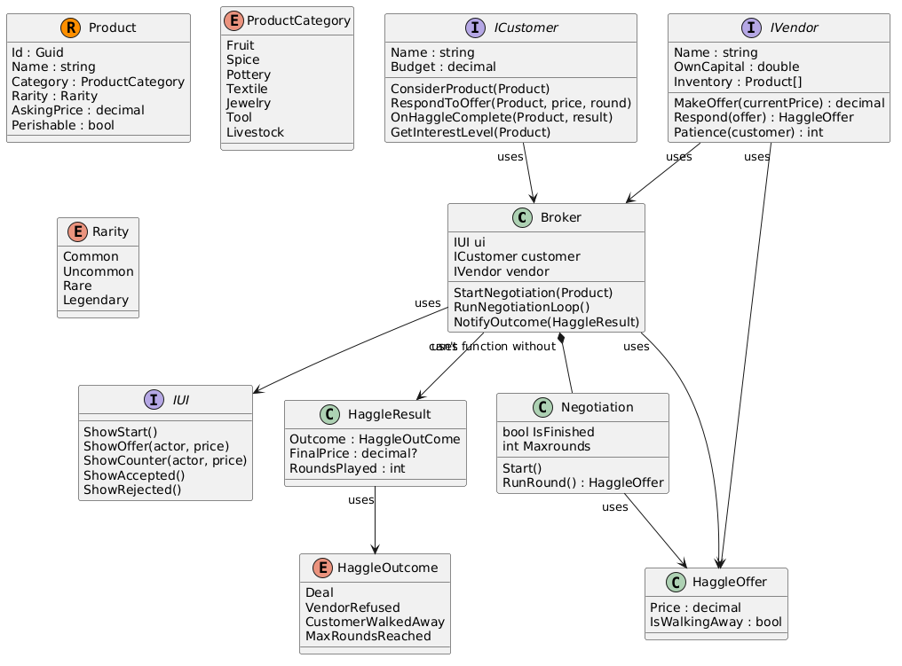

Haggle system readme file

@startuml
Broker "uses" --> IUI
Broker "can't function without" *-- Negotiation
ICustomer "uses" --> Broker
IVendor "uses" --> Broker
HaggleResult "uses" --> HaggleOutcome
Broker "uses" --> HaggleOffer
Broker "uses" --> HaggleResult
Negotiation "uses" --> HaggleOffer
IVendor "uses" --> HaggleOffer

class Broker {
    IUI ui
    ICustomer customer
    IVendor vendor
    StartNegotiation(Product)
    RunNegotiationLoop()
    NotifyOutcome(HaggleResult)
}

interface IUI {
    ShowStart()
    ShowOffer(actor, price)
    ShowCounter(actor, price)
    ShowAccepted()
    ShowRejected()
}

class Negotiation {
    bool IsFinished
    int Maxrounds
    Start()
    RunRound() : HaggleOffer
}

class HaggleOffer {
    Price : decimal
    IsWalkingAway : bool
}

class HaggleResult {
    Outcome : HaggleOutCome
    FinalPrice : decimal?
    RoundsPlayed : int
}

enum HaggleOutcome {
    Deal
    VendorRefused
    CustomerWalkedAway
    MaxRoundsReached
}

interface ICustomer {
    Name : string
    Budget : decimal
    ConsiderProduct(Product)
    RespondToOffer(Product, price, round)
    OnHaggleComplete(Product, result)
    GetInterestLevel(Product)
}

interface IVendor {
    Name : string
    OwnCapital : double
    Inventory : Product[]
    MakeOffer(currentPrice) : decimal
    Respond(offer) : HaggleOffer
    Patience(customer) : int
}

record Product {
    Id : Guid
    Name : string
    Category : ProductCategory
    Rarity : Rarity
    AskingPrice : decimal
    Perishable : bool
}

enum ProductCategory {
    Fruit
    Spice
    Pottery
    Textile
    Jewelry
    Tool
    Livestock
}

enum Rarity {
    Common
    Uncommon
    Rare
    Legendary
}
@enduml

